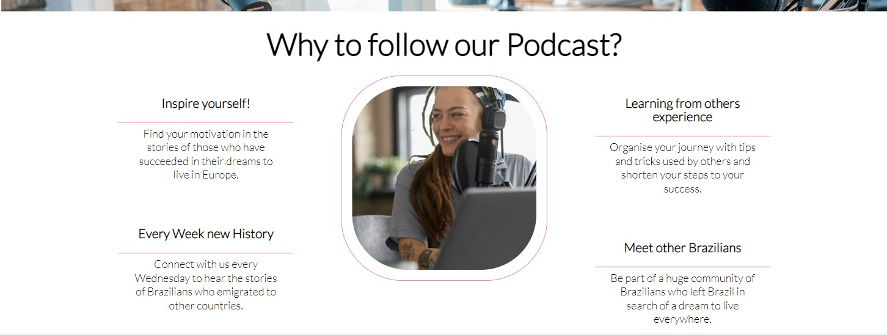
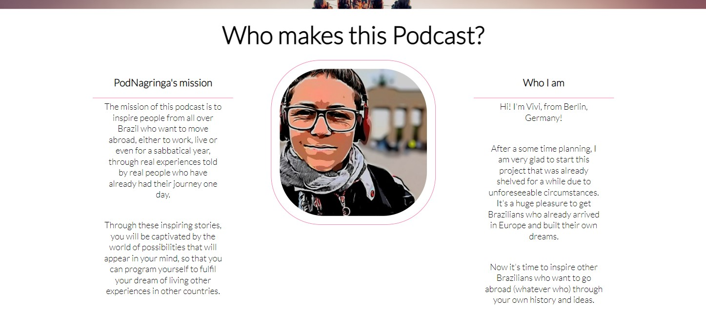
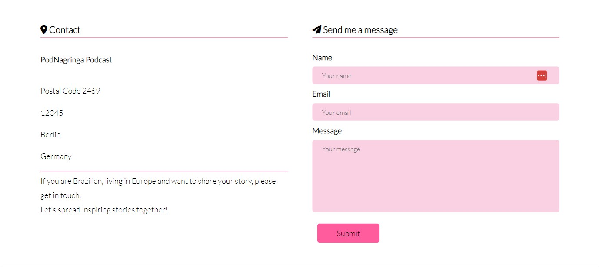
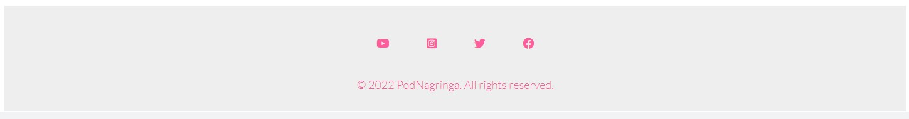
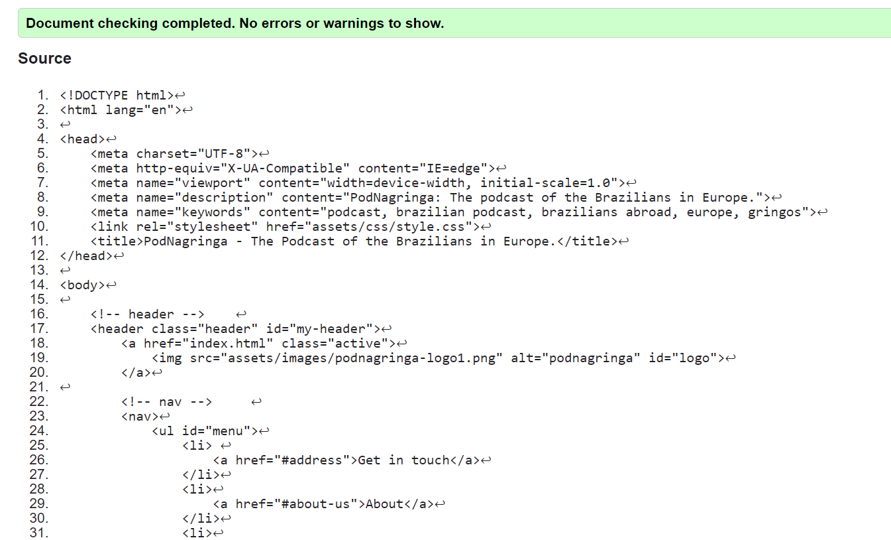
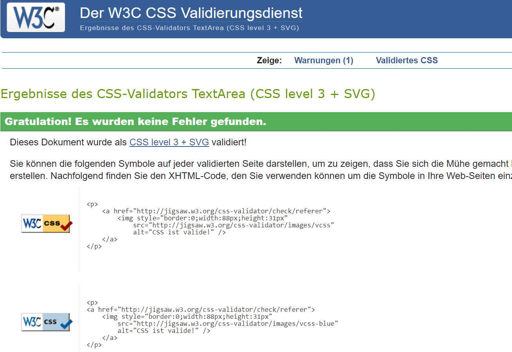
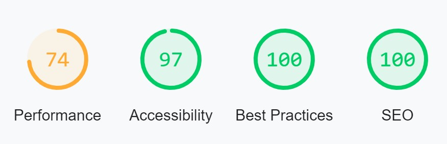
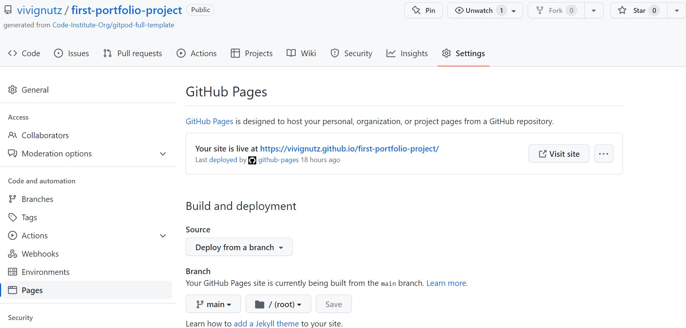

# PodNagringa Podcast

For the first milestone task with Code Institute, I created a one-page website that features the "NaGringa Podcast", an actual podcast project that will go live later in 2022.

The goal of the website is to present a first impression of the NaGringa Podcast project, informing its mission, who is behind the work, its social networks and also a contact form for potential interested parties.

My motivation for this project was to start the branding process of PodNagringa Podcast, given that it is a real project that is being planned and developed concurrently by me now.

This first project put me in touch with various uses of the programming languages HTML, CSS and also how to use GitHub and Gitpod, as well as thinking about the user's perspective using UX fundamentals. 
Moreover, the whole project helped me to start my thoughts from the programming logic perspective.

A preview of the project can be seen here: https://vivignutz.github.io/first-portfolio-project/

## User Experience (UX)

Thinking of the user, the PodNagringa Podcast aims to supply the lack of information regarding bureaucracy, housing, health insurance, education, working, taxes, etc, that all Brazilians immigrants in Europe face.
But with all information and tips coming from the guests of this podcast, whose are also Brazilians living in Europe, they can find easily their way to make their dreams of living abroad come true faster.

-   #### First impressions of the users

	-  First of all, the tag line with the sentence "PodNagringa: The podcast of the Brazilians in Europe" is showing, when the cursor comes throught the brownser tab. It permits the visitor recognize in first instance which website is in this tab, when this visitor has many tabs opened in his/her device.

    -  As a first time visitor, I could immediately recognize that, it is a podcast about Brazilians abroad due to the name "PodNagringa". 

    - As a first time visitor, I could easily scroll the one-page website and navigate through its links, being in touch with its simple and objective content, which shows a project of a podcast is to present the project and initiate contacts for the near future. 

    -  As a first time visitors, I could navigate throughout the site, regardless of screen size.

-   #### Returning Visitor Goals
    
    -  As a returning visitor, I want to get in touch with the podcast's host and could send my message via contact-form present in the link "Get in Touch" of the menu.

    -  As a returning visitor, want to visit the social media of the podcast, to know more about the launch date of the podcast.

    -  As a returning visitor, I want to be able to contact the owner of the site.
    
-   #### Frequent User Goals

    -  As a Frequent User, I want to see if there are any updates about the new guests or even write a message to be one of the guests.
    
## Features

### Existing Features

-   __F01 Header with Navigation Links__

	- The header is featured at the top of the page and includes a logo and navigation links.

	-  The logo is placed in the left corner and a menu is placed in the right corner.

	-  The logo image is a .pgn file and was designed by me with https://www.canva.com/. When the logo is clicked on it will take the user to the top of the page.

    - The navigation links includes a Home page, About and Get in Touch links which are responsive on multiple screen sizes. On small screens (e.g. mobile devices) the Home, Menu and Contact links move to under the Logo.

    - The jeader uses position sticky, it allows the user to easily navigate as it will always be visible when scrolling the page.

    -   The navigation links has a colour change underline when hovered over.

-   __F02 Parallax First Section__

    - This first section has a full-screen background image, which shows a setup of a podcast referring to the project idea. 

    - On this section is a div with an h1 with the name of the podcast project. This div is styled in CSS with a backgound colour with oppacity for a transparency, that makes it possible to read the name.

    - This image is scrolling in a parallax effect, bringing a clean visual and a soft impression to the visitors about the project; the image was took from the free Copyright data bank of https://www.freepik.com/, in .jpeg format.

- __F03 Parallax Second Section__   

	- The second section shows the idea of the project with 4 reeasons why to follow the podcast. This sentences shows more about the project and the visitors can have a general idea about the expectations they can have of the near future project. 

	- This whole parallax section was build with 3 divs:
		 - the div#left-about shows 2 motivation sentences built with an h3 and a paragraph; 

		 - the div#right-about has the same display, and

		 - the div#center-about shows a .jpeg format general photo of a podcast, took from the free Copyright data bank of https://www.freepik.com/, with a solid border around the photo.

-   __F04 Parallax Third Section__

    - This third section has a full-screen background image, which shows the Brandenburger Gate in Berlin, Germany. 

    - On this section is a div with an h1 with the sentence "From Berlin to the world". Both photo and sentence in this section refer to the city where the project will take place.

    - This div is styled in CSS with a backgound colour with oppacity for a transparency, that makes it possible to read the name.

    - This image is scrolling in a parallax effect and was took from the free Copyright data bank of Freepik, in .jpeg format.

- __F05 Parallax Fourth Section__   

    - The fourth section is linked to the "About" of the navigation menu and presents the mission and the host of the podcast project.  

    - This whole parallax section was build with 3 divs:
		 - the div#left-mission shows presents the mission of this podcast project in a sentence built with an h3 and a paragraph;

		 - the div#right-mission has the same display, and presents the host of the project;
         
		 - the div#center-abou a .jpeg format general photo of a podcast, took from the free Copyright data bank of Freepik, with a solid border around the photo.
  

- __F06 Parallax Fifth Section__   

    - The fifth container is linked to the "Get in Touch" (contact) of the navigation bar, and presents two different ways of contact: a postal code from Berlin, and a contact form. 

    - The 2 divs of this section are displayed namely "address" div and "form" div.

    - The "address" div contains a postal code from Berlin, with a h3 "Contact" and a styled icon of Font Awesome icon (fa-location-dot). Below the postal code from Berlin there is a "call to action" paragraph message which invites visitors to be in touch and be part of the podcast.

    - The "form" div was built with 2 textboxes (name and email), one textearea message block and an submit button.

- __F07 Footer__

    - The footer is featured underneath the whole website and contains an unordered inline list, with four social media icons (YouTube, Instagram, Twitter and Facebook), which were linked with the real social medias pages of the podcast project. 

    - The social media icons were took from Font Awesome icons and style with CSS. They are central positioned to offer to keep offering to the visitors a clear impression of the website.

    - Inside of the footer there is a div "footer" with the Copyright information, also centralized.

- __F08 Meta Data__

PodNagringa: The podcast of the Brazilians in Europe.

- __F09 Features Left to Implement__

A Fav icon.
A form submitted feature.

## Design

- I have used different shadow of pink and a soft grey, in order to follow the color of the logo. But beside of that, I kept the webiste clear in general. 

- For the text colour I choose let as default because of the grey used in the head.

- I have use a parallax-effect in order to provide some movement at the website, which was build only with HTML5 and CSSs languages.

## Technologies Used

- HTML5
- CSS3
- [Google Fonts:](https://fonts.google.com/) To import font family ’Poppins’ into the style.css file which is used on all pages.
Added fallback font sans-serif.
- [Font Awesome:](https://fontawesome.com/) Was used in header and contact section to add icons for aesthetic and UX purposes.
- [GitHub:](https://github.com/) GitHub is used to store the projects code after being pushed from Git.
- [Git](https://git-scm.com/) Git was used for version control by utilizing the Gitpod terminal to commit to Git and Push to GitHub.
- [Gif Cap:](https://gifcap.dev/) To record my screen and transfor in a .gif format.
- [Freepik:](https://freepik.com/) Free Image Data Bannk.
- [Am I Responsive:](http://ami.responsivedesign.is) Checking the responsive.

## Tests

### Browser testing

- The browsers I have used to test the page were Chrome, Brave and Microsoft Edge. The same functioning could be seen.

- The tests were done using Windows 11 Pro and Android 11 device. 

- I have tested this page works on iOS devices using Safari browser (iPad).

### Responsivness

- I have tested that this page works on different screen sizes from Samsung Galaxi S8+ (360px wide) and large screens like 4k.

- The Chrome developer tool have been used to check the responsivness of the website. 

### Validator Testing 

For Markup Validator I have use the W3C Validator and for CSS, the W3C CSS Validator Services to validate all pages of the project to ensure there were no syntax errors in there.

- W3C Markup Validator

- W3C CSS Validator

I have confirmed that the colours and fonts chosen are easy to read and accessible by running it through lighthouse in Chrome developer tools.

- Lighthouse

### Further Testing

- Navigation links on header: all works correctly.

- TUnderline colour-effect in the navigation bar: when hovering over, works correctly.

- External links to the four social media channels: works correctly.

- I have tested that name, email and message is required to submit the form in the contact section.

- I have tested that the email input field must contain @ symbol to submit the form in the contact section.

- I have tested that the form submit button word "Sbumit" changes the colour of the text when hovering over.

### Solved bugs

- When testing on the tablet screen (820 x 1180 px), the Parallax Fourth Section was not configured for responsive pages like Prallax Second Section one. I realized that the div had a "class" and not an "id". After this change, the bug was fixed and responde as expected. 

- Property value local was added in the media query to fix this issue.

- When testing on Brave browser using the developer tools, I realized that the Social Media icons were located to the left side and not centralized. I fixed this bug decreasing the padding.

- The logo was not styck inside of the head. I changed the positio to fixed.

## Deployment

- The site was deployed to GitHub page, according to the steps:

  - Log in to GitHub > GitHub repository > first-portfolio-project.
  - "Settings" > "Pages" (on the left hand menu).
  - Under "Source" > "Main" > "Root".
  - Click on "Save".

## Credits

- [Google Fonts:](https://fonts.google.com/) Font family ’Lato’ used on all pages.
- [Font Awesome:](https://fontawesome.com/) Oly used in fifth section to add icons at the style.
- [Am I Responsive:](http://ami.responsivedesign.is) Checking the responsive.
- [Gif Cap:](https://gifcap.dev/) To record my screen in .fig format.

### Acknowledgements

- A huge thank to my mentor at Code Institute for helpful feedbacks and to the tutors for helping me while the process.
